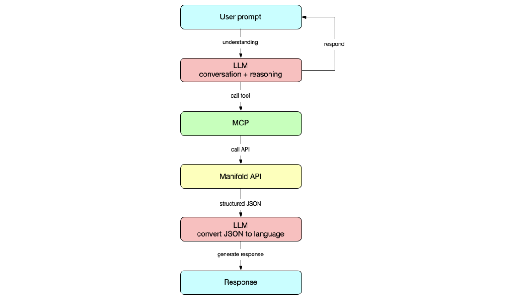

# README

## Overview

Modern systems like Manifold expose powerful functionality, but interacting with them often requires deep knowledge of APIs, event schemas, and system-specific concepts. This creates a barrier for new developers and limits accessibility for non-technical users. A natural language interface lowers this barrier by allowing users to interact with the system conversationally—issuing commands, querying state, and triggering workflows without needing to understand the underlying implementation details.

This project explores how to build that interface using Model Context Protocol (MCP) combined with picos. MCP provides a structured way for large language models to call tools and interact with external systems, while picos provide a decentralized, event-driven runtime for executing logic. Together, they form a compelling architecture: the LLM handles intent and language, MCP translates that into structured actions, and the pico engine executes those actions reliably.

The result is a conversational layer over Manifold that maps user intent directly to system behavior. This repository serves as a reference implementation for that pattern—demonstrating how MCP and picos can be composed into a full-stack application that bridges natural language and distributed event systems.

## Architecture



This architecture separates concerns across clear layers:

- **Chat UI** – Handles user interaction and displays responses
- **Express / Socket.io** – Manages real-time communication between frontend and backend
- **MCP Client** – Interfaces with the LLM (e.g., Claude via Bedrock) and formats tool calls
- **MCP Server** – Exposes system capabilities as callable tools
- **Pico Engine** – Executes events (KRL rulesets) and maintains system state

For a deeper breakdown of how data flows through the system, see docs/how-it-works.md.

## Key Concepts

Before diving into the code, it’s important to understand a few core ideas:

### Picos

Picos are lightweight, event-driven computing units that run inside the pico engine. Each pico has its own state and communicates via events. A critical concept is the Event Channel Identifier (ECI), which acts as the address for sending events to a specific pico. Without the ECI, you cannot interact with a pico.

### Manifold

Manifold is a platform built on the pico engine that enables the creation and orchestration of pico-based systems. It provides the environment where rulesets are deployed and executed.

Link to [Manifold](https://manifold.picolabs.io/)

### MCP (Model Context Protocol)

Model Context Protocol is a protocol that allows language models to interact with external tools in a structured way. Instead of generating raw text, the model can invoke defined operations, making it ideal for integrating LLMs with systems like the pico engine.

Link to [MCP Documentation](https://code.claude.com/docs/en/mcp)

## Project Structure

```text
├── github/workflows
├── docs
├── Manifold-api/           # .krl rules for the pico engine (MCP logic)
├── prompts/                # Prompt templates used by the MCP / LLM
├── scripts/                # Automation scripts (setup, teardown, testing)
├── src/                    # Application source code (frontend + backend)
│   ├── backend/
│   │   ├── mcp-server/
│   │   ├── utility/
│   │   └── llm/
│   ├── mcp-client/
│   └── frontend/
├── test/                   # Test suites
│   ├── backend/
│   │   ├── mcp-server/
│   │   ├── backend/
│   │   └── mcp-client/
│   └── frontend/
```

## Prerequisites

Make sure you have the following installed:

- Node.js (v20+ recommended)
- npm
- Docker (required for test scripts)

Verify installations:

```bash
node -v
npm -v
docker -v
```

## Usage

### Install Dependencies

Make sure you’ve installed project dependencies:

```bash
npm install
```

### Environment Variables

Follow `.env.example` to set up your own .env file. You will need to supply your own values for the AWS variables, but should otherwise use the defaults.

### Setup

Run the full project setup. This will install the manifold ruleset to the pico.
After running the setup script you can then start the pico engine at will.

```bash
npm run setup
pico-engine
```

The _npm run setup command_ runs the scripts/setup.sh script.

### Teardown

Stop servers and clean up any temporary processes or files:

```bash
npm run teardown
```

This runs the scripts/teardown.sh script.

### Running Tests

To run the Jest test suite:

```bash
npm test
```

Or equivalently:

```bash
npm run test
```

## Running the Frontend

To test or use our frontend component for interacting with the MCP client/LLM, you will need three terminals open and running.

1. Run `npm run dev` to open vite
2. Run `npm run proxy` to connect to the mcp server
3. Run `pico-engine` to run the engine
