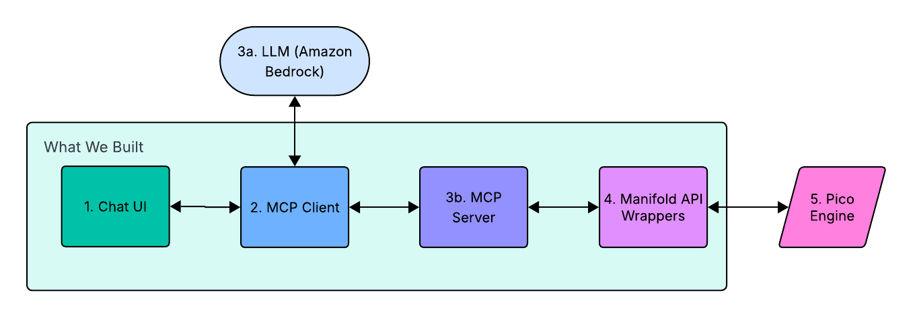

# How It Works

This system connects a natural language interface to a distributed event-driven backend. At a high level, a user types a message, a language model interprets it, and the system translates that intent into events executed by the pico engine.

The flow is designed to separate responsibilities cleanly: the frontend handles interaction, the backend manages communication, MCP structures tool usage, and picos execute logic.

## End-to-End Flow

For an example, we will be using the request to "Create a backpack" to demonstrate how it travels through every layer of the system.

### 1. User Input (Chat UI)

The process begins with the file `ChatComponent.jsx`. A user of the conversational interface types in the request to "Create a backpack". The message is sent via HTTP POST to the api/chat endpoint within the `api-proxy.js` file.

### 2. MCP Client

The `api-proxy.js` file serves as the headquarters for bridging the server and the MCPClient. It receives the request and passes it to the MCPClient (`index.js`) to be processed. The MCPClient sends a command (consisting of the formatted message and available tools) to Amazon Bedrock.

### 3. Tool Invocation (MCP Server)

Bedrock identifies the user's intent to "Create a backpack" and returns a JSON instruction to call the `manifold_create_thing` tool:

- The MCP client sends the request to the MCP Server in `server.js`. This is done via `stdio`, which is a standard Model Context Protocol communication method where the Client and Server talk over a persistent local process.
- The MCP server validates and routes the request to the `manifold_create_thing` operation in `krl-operation.js`.

### 4. Manifold API Wrapper

The operation simply calls the API wrapper function `createThing(thingName)` from the `api-wrapper.js` file. The thingName is specified as "Backpack", and becomes part of a direct fetch request to the Manifold API.

### 5. State & Logic (Pico Engine)

The Manifold API and the Pico Engine recieve the event, execute the relevant KRL ruleset, and update the state. At this point, the pico-engine developer UI can be visually inspected to verify the creation of a new "Backpack" item.

### 6. Response Propagation

The result flows back up the stack:

- Pico Engine -> MCP Server -> MCP Client -> Frontend
- Note: Real-time status updates travel back to the UI via Socket.io

The user sees a response in natural language affirming that their new "Backpack" was successfully created!
